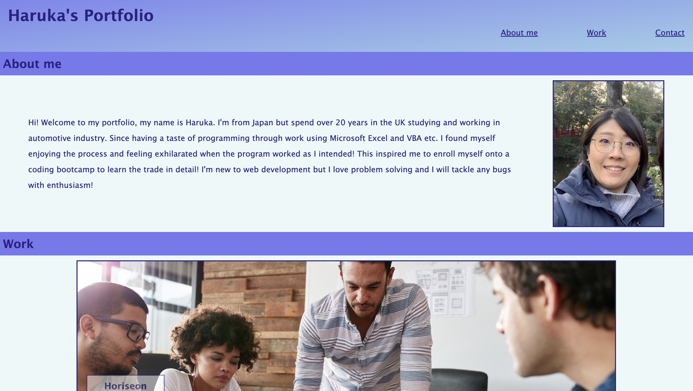

# Haruka-s-Portfolio
Website to showcase my web development projects

## Links to the webpage and repository

To access the website use [Haruka's Portfolio](https://haruka08.github.io/first-day-repo/)

To access the GitHub repository use [GitHub Repository Haruka-s-portfolio](https://github.com/Haruka08/first-day-repo.git)

## Content

The website consists of following 3 sections:

1. About me
    - Short introduction of Haruka Hashimoto
    - Image of Haruka Hashimoto

2. Work
    - Images linked to deployed websites
    - contains 6 images of varying sizes
    - Due to insufficient number of work done so far, link only available to the first work "Horiseon".
    - The rest of the images will be updated with more work as more work is completed

3. Contact
    - List of contact information
    - email linked to open up a blank email page in a default email
    - linkedIn address linked to Haruka Hashimoto's page
    - CV linked to open a word document in web version
    
## Navigating through the website

Following list of menues located at the header are hyperlinks and it will navigate to the corresponding sections within body element of the page.

- [About me](https://haruka08.github.io/first-day-repo/#search-engine-optimization)

- [Work](https://haruka08.github.io/first-day-repo/#online-reputation-management)

- [Contact](https://haruka08.github.io/first-day-repo/#social-media-marketing)

## Screenshot of the modified website

## Images for About me/Work section

## List of contact information with hyperlink

- E-mail: mailto:haruka.hashimoto08@gmail.com

- LinkedIn: https://www.linkedin.com/in/haruka-h-587b41100

- CV: ./assets/Haruka-Hashimoto-DOC.pdf